# ext_plugin Call Stack Analysis

## Module Overview

The `ext_plugin` module provides a JavaScript execution environment using Deno's runtime. It enables Sapphillon to run plugin scripts with controlled permissions.

## Module Structure

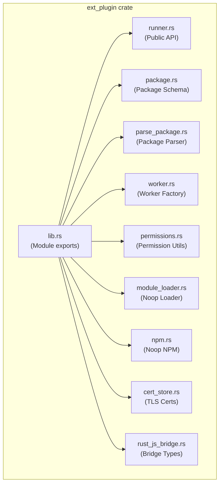

---

## Primary Call Stacks

### 1. `run_js` - Execute JavaScript Code

```mermaid
flowchart TB
    subgraph "runner.rs"
        run_js["run_js(script, permissions_options)"]
    end

    subgraph "worker.rs"
        create_main_worker["create_main_worker(permissions_options)"]
    end

    subgraph "permissions.rs"
        create_descriptor_parser["create_descriptor_parser()"]
        create_permissions["create_permissions(permissions_options)"]
    end

    subgraph "cert_store.rs"
        SapphillonRootCertStoreProvider_new["SapphillonRootCertStoreProvider::new()"]
    end

    subgraph "module_loader.rs"
        NoopModuleLoader["NoopModuleLoader"]
    end

    subgraph "npm.rs"
        NoopInNpmPackageChecker["NoopInNpmPackageChecker"]
        NoopNpmPackageFolderResolver["NoopNpmPackageFolderResolver"]
    end

    subgraph "Deno Runtime"
        MainWorker["MainWorker::bootstrap_from_options()"]
        execute_script["worker.execute_script()"]
        dispatch_load["worker.dispatch_load_event()"]
        run_event_loop["worker.run_event_loop()"]
        dispatch_beforeunload["worker.dispatch_beforeunload_event()"]
        dispatch_unload["worker.dispatch_unload_event()"]
    end

    run_js --> create_main_worker
    create_main_worker --> create_descriptor_parser
    create_main_worker --> create_permissions
    create_main_worker --> SapphillonRootCertStoreProvider_new
    create_main_worker --> NoopModuleLoader
    create_main_worker --> NoopInNpmPackageChecker
    create_main_worker --> NoopNpmPackageFolderResolver
    create_main_worker --> MainWorker
    run_js --> execute_script
    run_js --> dispatch_load
    run_js --> run_event_loop
    run_js --> dispatch_beforeunload
    run_js --> dispatch_unload
```

---

### 2. `run_js_with_string_arg` - Execute JS with String I/O

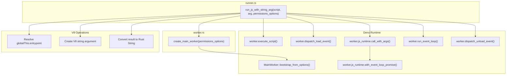

---

### 3. `SapphillonPackage::new` - Parse Plugin Package

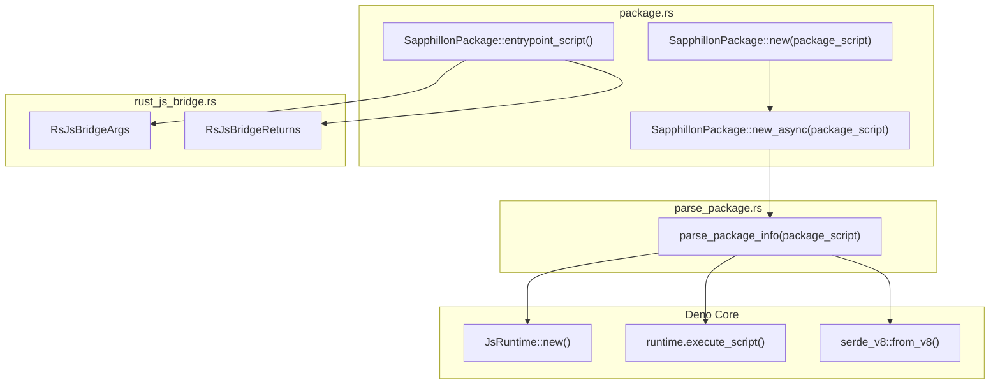

---

### 4. `SapphillonPackage::execute` - Execute Plugin Function

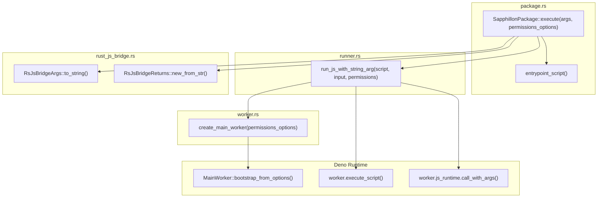

---

## Complete Integration Flow

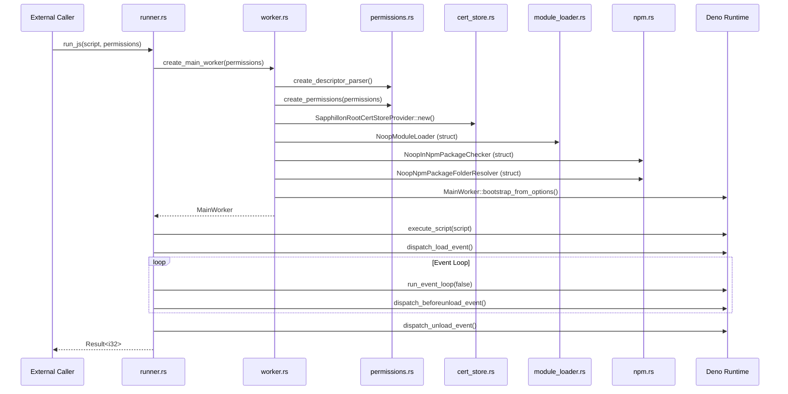

---

## Function Reference Table

| Module | Function | Description |
|--------|----------|-------------|
| `runner.rs` | `run_js()` | Execute JS code, return exit code |
| `runner.rs` | `run_js_with_string_arg()` | Execute JS with string input/output |
| `worker.rs` | `create_main_worker()` | Create configured Deno MainWorker |
| `package.rs` | `SapphillonPackage::new()` | Parse package from script (sync wrapper) |
| `package.rs` | `SapphillonPackage::new_async()` | Parse package from script (async) |
| `package.rs` | `SapphillonPackage::execute()` | Execute a plugin function with given arguments |
| `package.rs` | `entrypoint_script()` | Generate JS entrypoint wrapper |
| `parse_package.rs` | `parse_package_info()` | Execute package script and deserialize |
| `permissions.rs` | `create_descriptor_parser()` | Create Deno permission parser |
| `permissions.rs` | `create_permissions()` | Create Deno permissions from options |
| `permissions.rs` | `permissions_options_from_sapphillon_permissions()` | Convert Sapphillon permissions to Deno format |
| `cert_store.rs` | `SapphillonRootCertStoreProvider::new()` | Create TLS cert store provider |
| `cert_store.rs` | `get_or_try_init()` | Lazy-load root certificates |
| `module_loader.rs` | `NoopModuleLoader::resolve()` | Reject module resolution |
| `module_loader.rs` | `NoopModuleLoader::load()` | Reject module loading |
| `npm.rs` | `NoopInNpmPackageChecker::in_npm_package()` | Always returns false |
| `npm.rs` | `NoopNpmPackageFolderResolver::resolve_package_folder_from_package()` | Always returns error |
| `rust_js_bridge.rs` | `RsJsBridgeArgs::new_from_str()` | Deserialize args from JSON |
| `rust_js_bridge.rs` | `RsJsBridgeReturns::new_from_str()` | Deserialize returns from JSON |

---

## Function Dependency Graphs (Detailed)

### Internal Function Dependencies

```mermaid
graph TD
    subgraph "Public Entry Points"
        run_js["run_js()"]
        run_js_with_string_arg["run_js_with_string_arg()"]
        SapphillonPackage_new["SapphillonPackage::new()"]
        SapphillonPackage_execute["SapphillonPackage::execute()"]
    end

    subgraph "runner.rs"
        to_js_error["to_js_error()"]
    end

    subgraph "worker.rs"
        create_main_worker["create_main_worker()"]
    end

    subgraph "permissions.rs"
        create_descriptor_parser["create_descriptor_parser()"]
        create_permissions["create_permissions()"]
        permissions_options_from_sapphillon["permissions_options_from_sapphillon_permissions()"]
        merge_allow_list["merge_allow_list()"]
    end

    subgraph "package.rs"
        SapphillonPackage_new_async["SapphillonPackage::new_async()"]
        entrypoint_script["entrypoint_script()"]
        SapphillonPackage_execute_impl["execute()"]
    end

    subgraph "parse_package.rs"
        parse_package_info["parse_package_info()"]
    end

    subgraph "cert_store.rs"
        SapphillonRootCertStoreProvider_new["SapphillonRootCertStoreProvider::new()"]
        get_or_try_init["get_or_try_init()"]
    end

    subgraph "rust_js_bridge.rs"
        RsJsBridgeArgs_new_from_str["RsJsBridgeArgs::new_from_str()"]
        RsJsBridgeArgs_to_string["RsJsBridgeArgs::to_string()"]
        RsJsBridgeReturns_new_from_str["RsJsBridgeReturns::new_from_str()"]
        RsJsBridgeReturns_to_string["RsJsBridgeReturns::to_string()"]
    end

    %% run_js dependencies
    run_js --> create_main_worker
    run_js --> to_js_error

    %% run_js_with_string_arg dependencies
    run_js_with_string_arg --> create_main_worker
    run_js_with_string_arg --> to_js_error

    %% create_main_worker dependencies
    create_main_worker --> create_descriptor_parser
    create_main_worker --> create_permissions
    create_main_worker --> SapphillonRootCertStoreProvider_new

    %% create_permissions dependencies
    create_permissions --> create_descriptor_parser

    %% permissions_options conversion
    permissions_options_from_sapphillon --> merge_allow_list

    %% SapphillonPackage dependencies
    SapphillonPackage_new --> SapphillonPackage_new_async
    SapphillonPackage_new_async --> parse_package_info

    %% entrypoint_script dependencies
    entrypoint_script --> RsJsBridgeArgs_to_string
    entrypoint_script --> RsJsBridgeReturns_to_string

    %% execute() dependencies
    SapphillonPackage_execute --> entrypoint_script
    SapphillonPackage_execute --> RsJsBridgeArgs_to_string
    SapphillonPackage_execute --> run_js_with_string_arg
    SapphillonPackage_execute --> RsJsBridgeReturns_new_from_str
    SapphillonPackage_execute_impl --> entrypoint_script
    SapphillonPackage_execute_impl --> run_js_with_string_arg
```

---

### runner.rs Function Dependencies

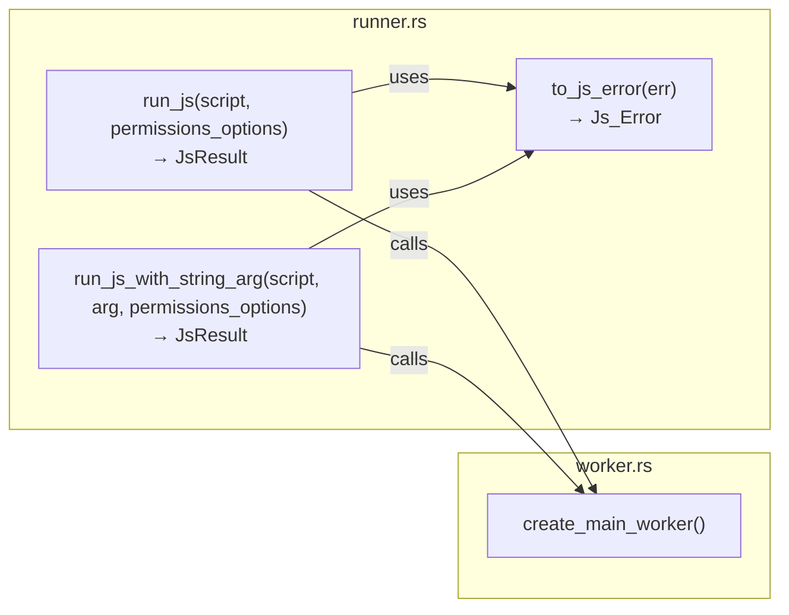

---

### worker.rs → permissions.rs Dependencies

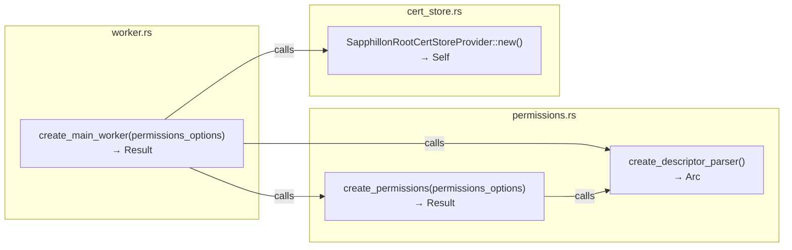

---

### package.rs → parse_package.rs Dependencies

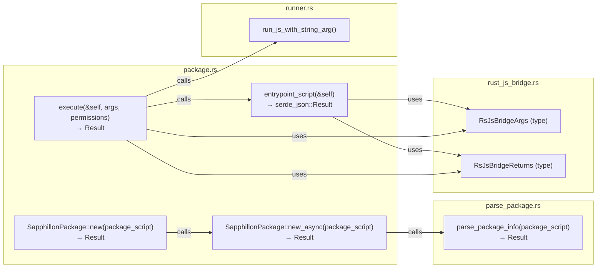

---

### permissions.rs Internal Dependencies

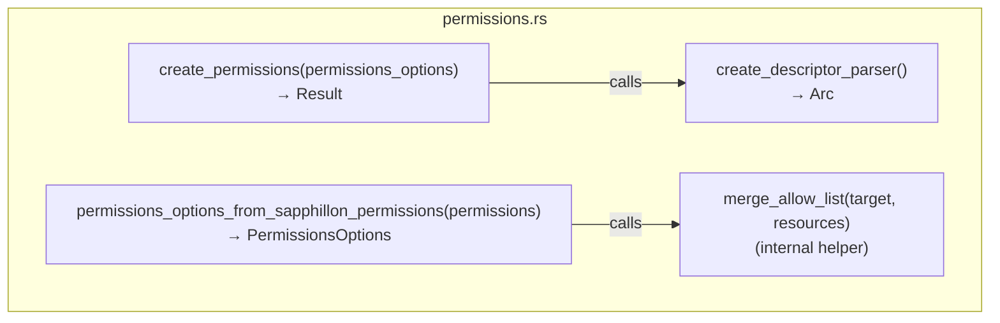

---

### Struct/Type Dependencies

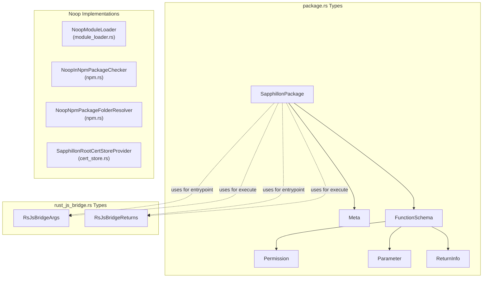

---

## Key Dependencies

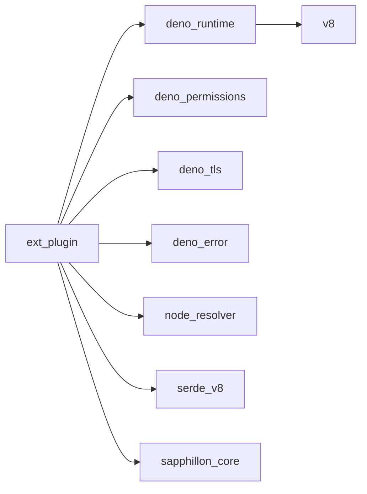
