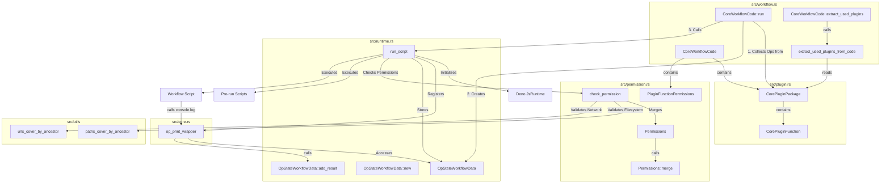

# Sapphillon Core Call Graph

This document illustrates the call graph and relationships between the main components of `sapphillon_core`.

## Component Description

### CoreWorkflowCode (`src/workflow.rs`)
The main entry point for executing a workflow. It holds the workflow code, associated plugins, and permissions.
- `run()`: Orchestrates the execution. It prepares the environment, collects plugin operations, and delegates execution to `run_script`.

### Runtime (`src/runtime.rs`)
Handles the Deno JavaScript runtime environment.
- `run_script()`: Sets up the `JsRuntime`, registers extensions (like `console.log` wrapper), enforces permissions, and executes the JavaScript code.
- `OpStateWorkflowData`: A shared state object stored in the Deno `OpState`. It holds execution results (stdout), permission configurations, and the workflow ID.

### Core (`src/core.rs`)
Contains core operations.
- `op_print_wrapper`: A Deno operation that intercepts `console.log` and `console.error`. It redirects output to `OpStateWorkflowData` if capturing is enabled, or to standard streams otherwise.

### Permission (`src/permission.rs`)
Manages permission logic.
- `check_permission()`: Verifies if the granted permissions are sufficient for the required permissions. It handles specific logic for filesystem paths and URLs (checking ancestor coverage).

### Plugin (`src/plugin.rs`)
Defines the structure of plugins.
- `CorePluginPackage` & `CorePluginFunction`: Represent the plugins and their functions available to the workflow. These provide the `OpDecl`s (native Rust functions callable from JS).
